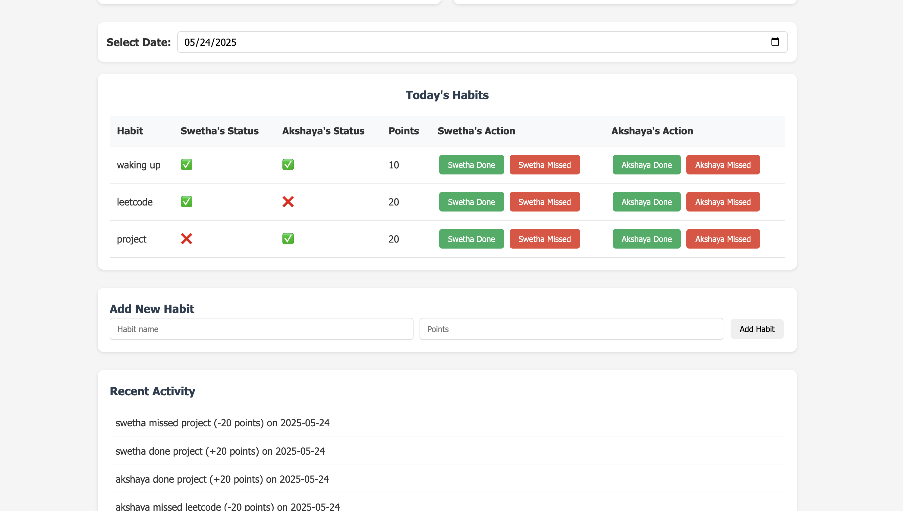

# Gamified Productivity Tracker

A simple, responsive two-person habit tracker web app built with HTML, CSS, and JavaScript. Track daily habits, assign points, and keep each other accountable with real-time updates using Firebase Realtime Database.

## Features

- **Two-person tracking:** Track habits for two users (customizable names)
- **Daily and overall scores:** See who leads today and overall
- **Date picker:** View and update habits for any day
- **Custom habits:** Add your own habits and assign point values
- **Action buttons:** Mark habits as Done or Missed for each user
- **Activity log:** See a history of recent actions
- **Responsive design:** Works on desktop and mobile

## Screenshots



## Getting Started

### 1. Clone the repository
```sh
git clone https://github.com/swetha-ganeshbabu/Gamified-Productivity-Tracker.git
cd Gamified-Productivity-Tracker
```

### 2. Set up Firebase
- Go to [Firebase Console](https://console.firebase.google.com/) and create a new project.
- In the Realtime Database, create a new database (test mode is fine for development).
- In Project Settings > General, add a new web app and copy your Firebase config.
- Replace the config in `firebase-config.js` with your own.

### 3. Run the app
Just open `index.html` in your browser. No build step required!

## File Structure
```
├── index.html
├── styles.css
├── app.js
├── firebase-config.js
├── README.md
```

## Usage
- Add habits using the form at the bottom.
- Use the date picker to view or update any day's habits.
- Click "Done" or "Missed" for each user and habit.
- Scores and activity log update in real time.

## Data Structure (Firebase)
```
scores: {
  user1: { total: 0, daily: { 'YYYY-MM-DD': 0 } },
  user2: { total: 0, daily: { 'YYYY-MM-DD': 0 } }
}
habits: [
  { name: 'waking up', points: 10, status: { 'YYYY-MM-DD': { user1: 'done', user2: 'missed' } } },
  ...
]
activityLog: [ ... ]
```

## Customization
- Change user names by editing the HTML and JS.
- Add more users or features as needed.

## Future Enhancements

Here are some ideas for future improvements and features you can add to this habit tracker:

- **Multi-user support:** Allow more than two users to join and track habits together.
- **User authentication:** Let users sign up, log in, and have their own private habit lists and scores.
- **Weekly/monthly streaks:** Track and display streaks for habits completed on consecutive days.
- **Progress charts:** Visualize progress over time with graphs (using Chart.js or similar).
- **Reminders & notifications:** Send email or push notifications to remind users about their habits.
- **Habit categories:** Group habits by type (health, productivity, etc.) for better organization.
- **Mobile app:** Build a companion mobile app using React Native or Flutter.
- **Dark mode:** Add a toggle for light/dark themes.
- **Export data:** Allow users to export their habit data as CSV or PDF.
- **Gamification:** Add badges, levels, or rewards for achieving streaks or milestones.
- **Admin dashboard:** For group or family use, allow an admin to manage users and habits.
- **Public leaderboards:** Show top users (opt-in) for friendly competition.

Feel free to fork this project and add your own enhancements!

## License
MIT 